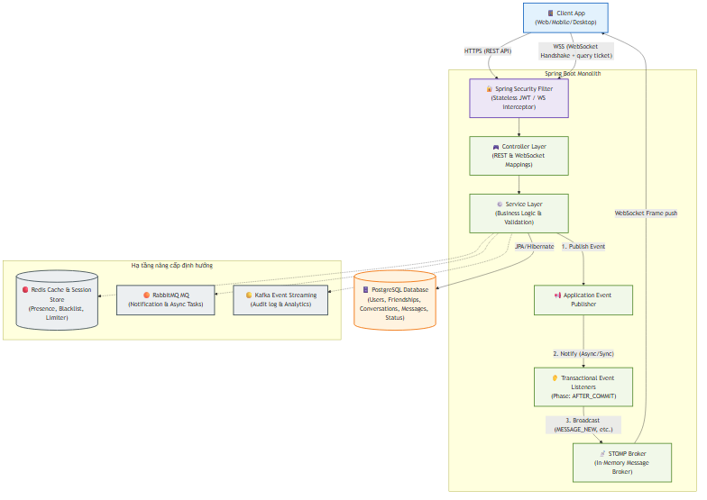
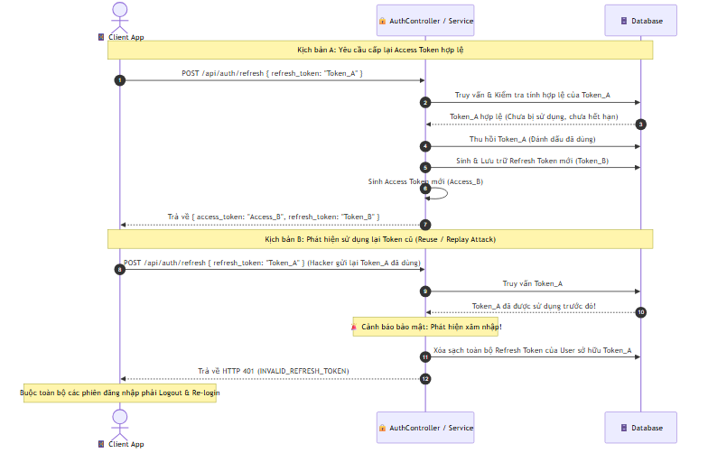
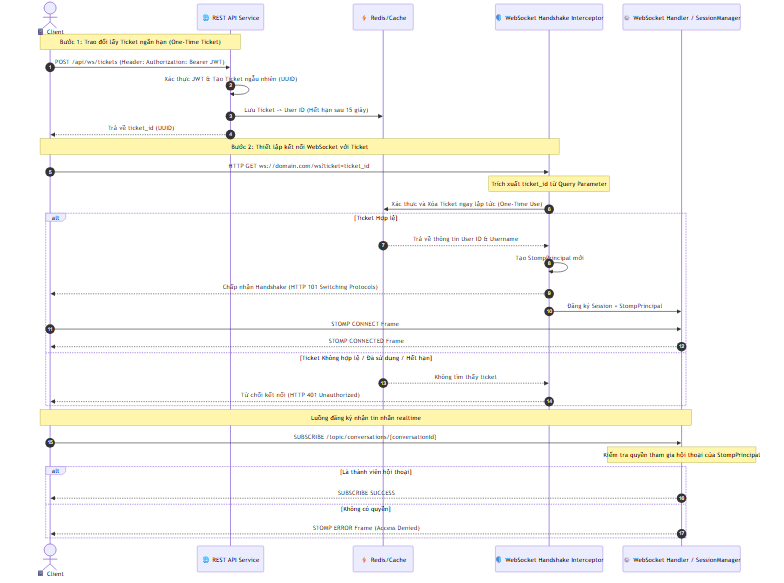
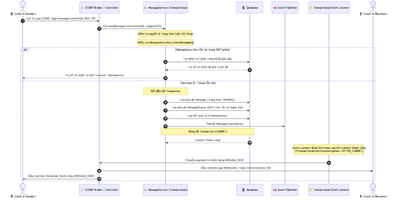
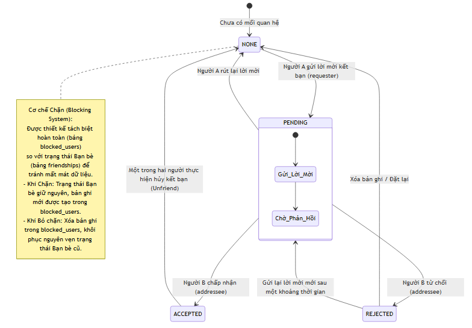
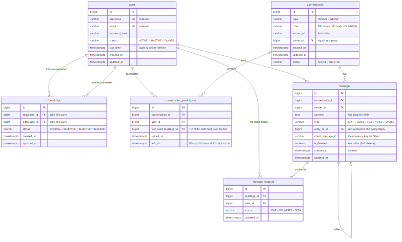

# 🚀 Sơ đồ Hệ thống & Luồng Xử lý (System Architecture & Flows)

Tài liệu này trực quan hóa cấu trúc kiến trúc, các luồng nghiệp vụ cốt lõi, trạng thái dữ liệu và mô hình thời gian thực của hệ thống **Spring Chat**. Tất cả sơ đồ được vẽ trực quan dạng ảnh PNG và mã nguồn Mermaid.js kèm theo.

> 📁 **Thư mục tài nguyên sơ đồ:** [docs/diagrams](./diagrams)

---

## 1. Kiến trúc Hệ thống Tổng quan (High-Level System Architecture)
🔗 *Xem file mã nguồn Mermaid:* [high_level_architecture.mmd](./diagrams/high_level_architecture.mmd)

Hệ thống hiện tại được thiết kế theo mô hình **Stateless Monolith**, sử dụng Spring Boot làm backend chính kết hợp PostgreSQL để lưu trữ dữ liệu bền vững.

---

## 2. Luồng Xác thực & Quay vòng Token (Auth & Token Rotation Flow)
🔗 *Xem file mã nguồn Mermaid:* [auth_token_rotation.mmd](./diagrams/auth_token_rotation.mmd)

Hệ thống sử dụng cơ chế **Refresh Token Rotation (RTR)** để tăng tính bảo mật cho kiến trúc stateless, chống lại các cuộc tấn công phát lại (Replay Attacks).

---

## 3. Luồng Kết nối & Đăng ký WebSocket STOMP (WebSocket Connection & Subscription)
🔗 *Xem file mã nguồn Mermaid:* [websocket_stomp_flow.mmd](./diagrams/websocket_stomp_flow.mmd)

Do các trình duyệt không hỗ trợ gửi Custom Headers trong quá trình HTTP Handshake, hệ thống sử dụng **Query Parameter** để xác thực WebSocket.

---

## 4. Luồng gửi Tin nhắn thời gian thực (Real-time Messaging Pipeline)
🔗 *Xem file mã nguồn Mermaid:* [realtime_messaging_pipeline.mmd](./diagrams/realtime_messaging_pipeline.mmd)

Đây là luồng nghiệp vụ quan trọng nhất, đảm bảo tính **toàn vẹn dữ liệu** (chống mất tin) và **ngăn ngừa gửi trùng lặp** (Idempotency) qua DB Transaction Commit Hook.

---

## 5. Luồng Trạng thái Bạn bè (Friendship State Machine Flow)
🔗 *Xem file mã nguồn Mermaid:* [friendship_state_machine.mmd](./diagrams/friendship_state_machine.mmd)

Quản lý mối quan hệ giữa hai người dùng trong hệ thống với các ràng buộc về quyền riêng tư và khả năng chặn tin nhắn.

---

## 6. Sơ đồ Thực thể Cơ sở dữ liệu (Database Entity Relationship Diagram)
🔗 *Xem file mã nguồn Mermaid:* [database_erd.mmd](./diagrams/database_erd.mmd)

Bản vẽ thiết kế thực thể trong PostgreSQL, hiển thị các khóa ngoại và các ràng buộc dữ liệu chính nhằm tối ưu hóa việc truy vấn tin nhắn và tính toán tin nhắn chưa đọc (`unreadCount`).

---

## 💡 Thiết kế Lập trình Phòng thủ & Biên Case (Defensive Architecture Notes)

Dựa theo nguyên tắc của **Senior Backend Engineer**, hệ thống giải quyết các vấn đề đồng thời (Concurrency) và phục hồi lỗi (Fault tolerance) như sau:

1. **Race Conditions trong gửi tin nhắn trùng (Duplicate Send):**
   - Sự kết hợp giữa `clientMessageId` + `conversationId` + `senderId` tạo ra một khóa định danh duy nhất (Idempotency Key).
   - Hệ thống cố gắng lấy khóa này trước khi thực hiện Transaction. Nếu khóa đã tồn tại trong DB, hệ thống từ chối ghi đè và trả lại trực tiếp bản ghi tin nhắn cũ để tránh trùng lặp tin nhắn khi Client bị lag mạng và ấn gửi nhiều lần.

2. **Race Conditions trong tính toán unreadCount:**
   - Trường `last_read_message_id` trong `conversation_participants` được cập nhật trực tiếp qua câu lệnh UPDATE chỉ mục để so sánh ID tin nhắn thay vì kéo dữ liệu về RAM để tăng giảm thủ công, giúp tránh hiện tượng ghi đè chéo (Lost Update) khi người dùng mở app trên nhiều thiết bị cùng lúc.

3. **Bảo toàn tin nhắn thời gian thực:**
   - Việc phát đi sự kiện WebSocket thông qua `SimpMessagingTemplate` được bọc bên trong `@TransactionalEventListener(phase = TransactionPhase.AFTER_COMMIT)`.
   - Nếu lưu dữ liệu vào PostgreSQL thất bại (như lỗi khóa ngoại, lỗi kết nối DB, hoặc lỗi validate), Transaction sẽ rollback và **không có** bất kỳ frame WebSocket nào được đẩy đi. Client nhận lỗi ngay lập tức, ngăn ngừa hiện tượng "tin nhắn ảo" (tin nhắn hiển thị trên giao diện của người nhận nhưng thực tế không được lưu trong DB).
